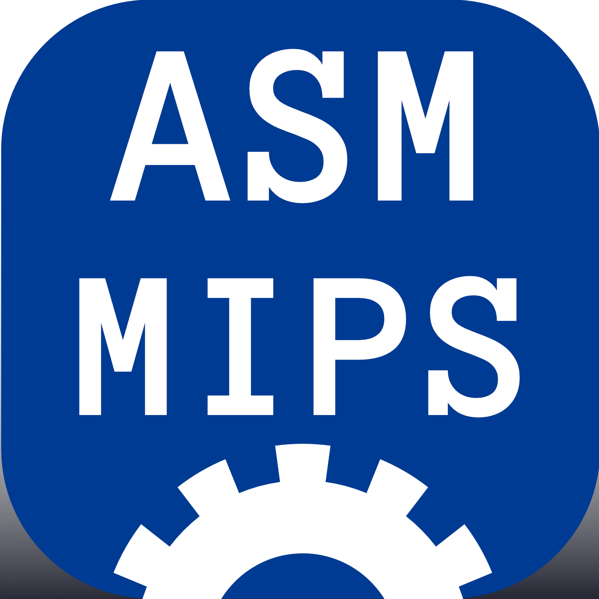

<!-- Kudos 2 @anuraghazra, I used his README as reference :D. -->
# CCWebi

<h3 align="center">
    ¡Bienvenido a mi perfil! / Welcome to my profile! &nbsp;
    

</h3>

- :technologist: I'm a Computer Science student from México :mexico:.
- :computer: I use VSCode and Sublime Text for coding.
- :penguin: I mainly use Windows, but I also use Fedora or Lubuntu as my OS. My fav lang is Haskell, and I love LaTeX.
- :student: My favourite topics are Tail Recursion and Binary Trees.
- :video_game: I like plant photography, cooking, eSport analysis, and sports.

### My GitHub Stats

> [!IMPORTANT]
> Stats are not accurate, since I have private repositories.

### Programming languages and tools I'm familiar with

    <code></code>&nbsp;&nbsp;
    <code></code>&nbsp;&nbsp;
    <code></code>&nbsp;&nbsp;
    <code></code>&nbsp;&nbsp;
    <code></code>&nbsp;&nbsp;
    <code></code>&nbsp;&nbsp;
    <code></code>&nbsp;&nbsp;
    <code></code>&nbsp;&nbsp;

> "Si lo puedes imaginar, lo puedes programar" - Programación ATS :fallen_leaf:.
