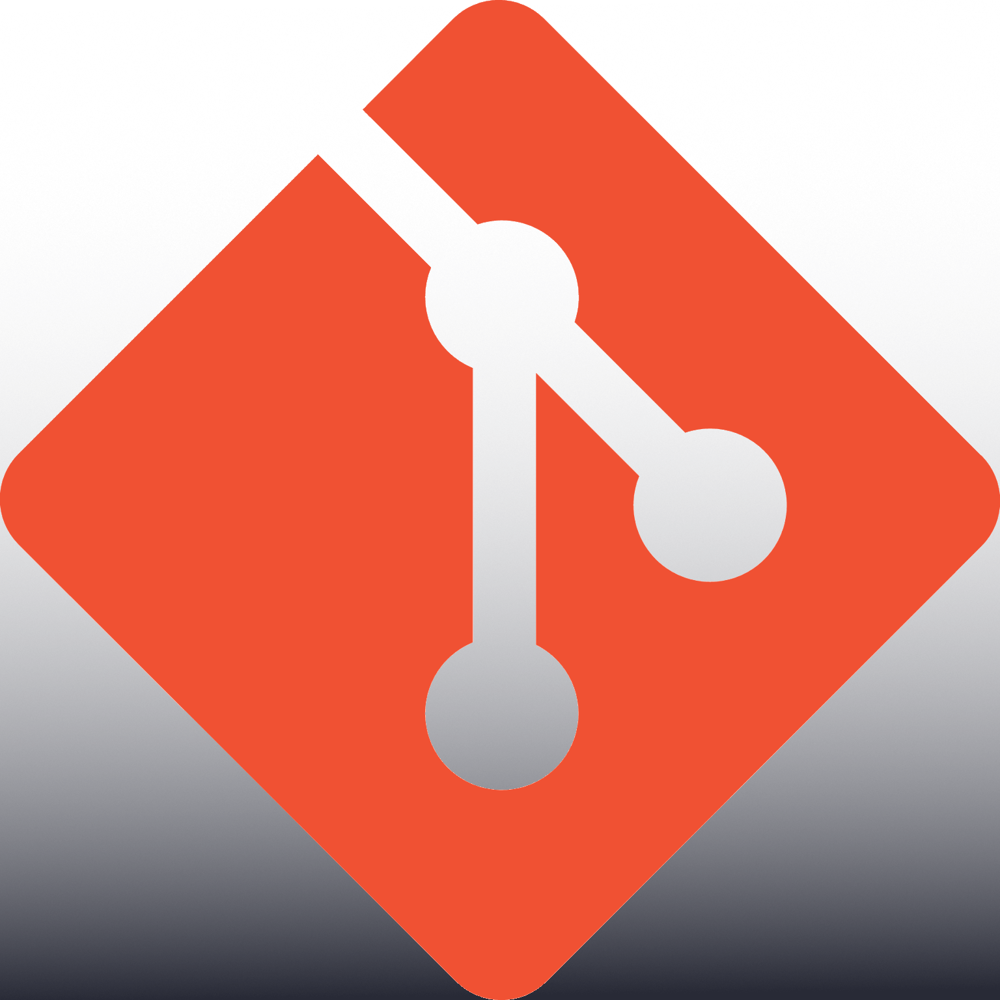

<!-- I used @anuraghazra README as reference :D. -->
<h3 align="center">
    ¡Bienvenido a mi perfil! / Welcome to my profile!
    

<h3/>
  
## CCWebi

- :technologist: I'm a Computer Science student from México :mexico: . 
- :computer: I use VSCode and Sublime Text for coding. 
- :penguin: I use Windows, Fedora and Lubuntu as OS.
- :student: I love data, backtracking, dictionaries, team projects, and learning.
- :video_game: I like photography, media editing, cooking, redstone, analysis fps gaming coaching, moody music, F1, NFL, and my lil' cyndaquil.

### My GitHub Stats (Public repos)

### Programming languages and tools I'm familiar with:
<!-- TODO: Edit pics to "dark mode" and add Prolog, Assembly, C, Python, VSCODE -->

    <code></code>&nbsp;&nbsp;
    <code></code>&nbsp;&nbsp;
    <code></code>&nbsp;&nbsp;
    <code></code>&nbsp;&nbsp;
    <code></code>&nbsp;&nbsp;

  
  
  

